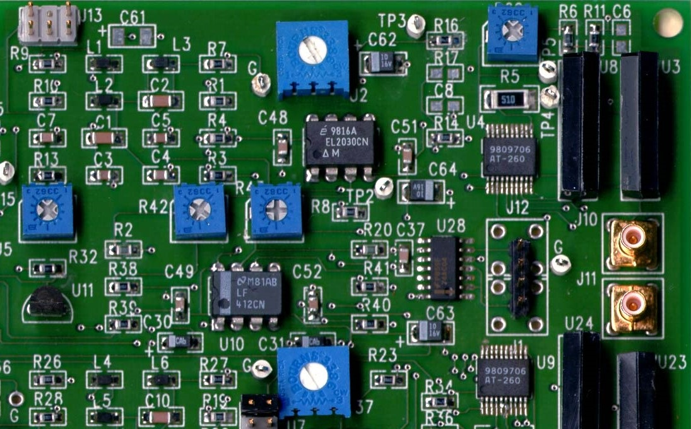
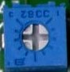
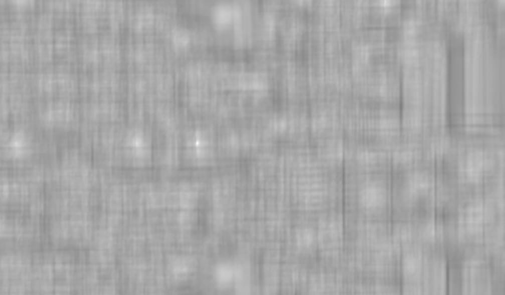

# <center> NCC(Normalized Cross Correlation)

从Pearson相关系数到模板匹配的NCC方法
## 1.**Pearson相关系数**
Pearson相关系数是用来衡量两个变量之间的相关性，由下式给出
$$p = \frac{cov(X,Y)}{\sigma(X)\sigma(Y)}$$
p在数值上在[-1,1]之间
- 当p=0时，说明两个变量不想关；
- 当p>0时，两个变量正相关，而且p越大正相关性越强；
- 当p<0时，两个变量负相关，而且p越小负相关性越强；


上式中$cov(X,Y)$表示的是两个变量$X、Y$的协方差，$\sigma(X)$表示的是变量X的标准差差，$\sigma(Y)$表示的是变量Y的标准差$。

## 2.**协方差 covariance**
协方差也是用来衡量两个变量之间的相关性的，当两个变量之间的协方差是0时不相关（两个变量相互独立），大于0时正相关，小于0时负相关。例如身高和体重之间的协方差就是一个正数，因为身高和体重是正相关的。
协方差由下式给出：
$$cov(X,Y)=E[(X-E(X))(Y-E(Y))]$$
其中E()表示变量的数学期望,eg:E(X)表示变量X的数学期望,$E[X]=\Sigma \mu_i x_i,\mu_i 是 x_i$的权重，如果每个样本的权重都相等的话则写为：$E[X]=\frac{\Sigma x_i}{n}$。

此外协方差的等价式

$$
\begin{aligned}
cov(X,Y)    &= E[(X-E(X))(Y-E(Y))]\\
            &=E[XY - XE(Y) - YE(X) + E(X)E(Y)]\\
            &=E(XY)-2E(X)E(Y) + E(X)E(Y)\\
            &=E(XY)-E(X)E(Y)
\end{aligned}
$$


**协方差示例**
有三个人的身高体重数据，X表示身高，Y表示体重
>X身高(cm): 100,150,200 \
>Y体重(kg): 50,100,150

$则身高和体重的协方差cov(X,Y)=E(XY)-E(X)E(Y)$
其中:

$E(X)=\frac{1}{3}(100+150+200)=150$,
$E(Y)=100,E(XY)=\frac{1}{3}(100*50+150*100+200*150)=\frac{50000}{3}$
$cov(X,Y)=E(XY)-E(X)E(Y)=\frac{50000}{3}-150*100=\frac{5000}{3}.$


## 3. **方差 variance**

在考察单个变量的分布特征时有方差(variance)的概念，方差是一个大于等于0的实数，方差为0表示变量分布完全集中在一个点上，方差越大变量的分布越分散。方差由下式给出：$$var(X)=E[(X-E(X))^2]$$ 观察可以看到方差是协方差的一个特例，即cov(X,X)=var(X).$

## 4.模板匹配中的NCC方法
模板匹配就是给定一个目标图和一个搜索图，采用一定的搜索策略去找到一个和目标相近的区域，在刚性模板匹配中，一般都是采用滑窗的方法来搜索，在比较两个图的相似度时有很多种方法，最简单的就是两个图像直接相减，NCC（Normalized Cross Correlation）就是计算两张图的pearson相关性，值越大说明两个图像越相像。

$记T_{m\times n}为目标图(target)$,$S_{M\times N}$为源搜索图(source),$S_{x,y}$为S中以点$(x,y)$为左上角的和T大小相同的子图，$R_{(M-m+1)\times (N-n+1)}$为匹配的结果图，则$$R(x,y)=\frac{cov(S_{x,y},T)}{\sigma(S_{x,y})\sigma(T)}$$  

其中$$
\begin{aligned}
cov(S_{x,y},T)  &=E(S_{x,y}T)-E(S_{x,y})E(T)\\
                &=\frac{\Sigma_{i=1}^{m}\Sigma_{j=1}^{n}S_{x,y}(i,j)T(i,j)}{mn} - \bar{S_{x,y}}\bar{T}
\end{aligned}
$$

$$\bar{S_{x,y}}=\frac{\Sigma_{i=1}^{m}\Sigma_{j=1}^{n}S_{x,y}(i,j)}{mn}$$

$$\bar{T} = \frac{\Sigma_{i=1}^{m}\Sigma_{j=1}^{n}T(i,j)}{mn}$$

$$\sigma(S_{x,y})=\sqrt{var(S_{x,y})}=\sqrt{\frac{\Sigma_{i=1}^{m}\Sigma_{j=1}^{n}{(S_{x,y}(i,j)-\bar{S_{x,y}}})^2}{mn}}$$

$$\sigma(T)=\sqrt{var(S_{x,y})}=\sqrt{\frac{\Sigma_{i=1}^{m}\Sigma_{j=1}^{n}{(T(i,j)-\bar{T}})^2}{mn}}$$

上面的式子展开看起来感觉很复杂，以往看到的也都是这样完全展开又组合在一起的式子，就像opencv官网的解释，很完整但是让人很费解，具体为什么是这样搞不清楚（也可能是我菜吧），但是看上面R(x,y)的式子意义是很明确的,就是计算两个图之间的Pearson相关系数。按照公式就可以直接开工写代码了。

## 5.实现过程
观察式子：$$R(x,y)=\frac{cov(S_{x,y},T)}{\sigma(S_{x,y})\sigma(T)}$$

可以发现$\sigma(T)$是固定的，模板给定之后值就确定了，只需要计算一次。$\sigma(S_{x,y}）和cov(S_{x,y},T)$的计算过程中一直要用到$\bar{S_{x,y}}$，如果直接去计算这个平均值将会有很多计算是浪费掉的，可以用积分图来加速这个过程

几个核心的步骤
- 积分图加速均值的计算
- 计算协方差时用到卷积用FFT加速
- 金字塔加速
- 指令集优化
- 多线程

在实现上第一版先只打算跑通整个NCC的计算流程，后续如果有机会的话可以再考虑做几个优化版本。目前很明确想到的有下面这几个：
- 积分图加速均值的计算
- 多线程计算

## 6.测试结果

- source



- target



- result



可以看到在目标处得到最大值，也就是正确匹配到了目标图。


## 7.部分核心源码

目前实现


### NCC.cpp

```C
namespace mycv
{


/**
 * @brief 模板匹配，归一化交叉相关算法。衡量模板和待匹配图像的相似性时
 * 用(Pearson)相关系数来度量。
 * r=cov(X,Y)/(sigma(X) * sigma(Y))
 * 其中cov(X,Y): 表示两个变量的协方差
 * cov(X,Y) = E[(X-E(x)) * (Y-E(Y))] = E(XY) - E(x)E(Y)
 * sigma(X): 表示X变量的标准差
 * sigma(Y): 表示Y变量的标准差
 * 
 * @param source : 搜索图CV_8UC1格式
 * @param target ：模板图CV_8UC1格式
 * @param result : 匹配结果的map图
 * @return int : 程序运行的状态码
 */
int NormalizedCrossCorrelation(
    const cv::Mat &source,
    const cv::Mat &target,
    cv::Mat &result
    )
    {
        if(source.empty() || target.empty())
        {
            MYCV_ERROR(kImageEmpty,"NCC empty input image");
            return kImageEmpty;
        }
        int H = source.rows;
        int W = source.cols;
        int t_h = target.rows;
        int t_w = target.cols;
        if(t_h > H || t_w > W)
        {
            MYCV_ERROR(kBadSize,"NCC source image size should larger than targe image");
            return kBadSize;
        }

        //r = cov(X,Y)/(sigma(X) * sigma(Y))
        //sigma(X) = sqrt(var(X))
        int r_h = H - t_h + 1; //结果图的高度
        int r_w = W - t_w + 1;
        double target_mean = calculateMean(target);
        double target_var = calculateVariance(target,target_mean);
        double target_std_var = std::sqrt(target_var);
        result = cv::Mat::zeros(cv::Size(r_w,r_h),CV_32FC1);
        for(int row = 0; row < r_h ; row++)
        {
            float * p = result.ptr<float>(row);
            for(int col = 0; col < r_w; col++)
            {
                cv::Rect ROI(col,row,t_w,t_h);//source上和目标图匹配的子图
                cv::Mat temp = source(ROI);
                double temp_mean = calculateMean(temp);
                double cov = calculateCovariance(temp,target,temp_mean,target_mean);
                double temp_var = calculateVariance(temp,temp_mean);
                double temp_std_var = std::sqrt(temp_var);
                p[col] = cov / ((temp_std_var + 0.0000001) * (target_std_var + 0.0000001));
            }
        }


        return kSuccess;
    }


/**
 * @brief 计算图像上ROI区域内的均值
 * 
 * @param input  : 输入的图像CV_8UC1
 * @param ROI  : 输入的ROI区域
 * @param mean  : 返回的区域均值
 * @return int 
 */
int calculateRegionMean(const cv::Mat &input,const cv::Rect &ROI,double &mean)
{
    if(input.empty())
    {
        MYCV_ERROR(kImageEmpty,"input empty");
        return kImageEmpty;
    }
    if(1 != input.channels())
    {
        MYCV_ERROR(kBadDepth,"Now only sopurt for one channel image");
        return kBadDepth;
    }
    int h = input.rows;
    int w = input.cols;
    
    if((ROI.x+ROI.width > w ) || (ROI.y+ROI.height > h)
    || ROI.width <= 0 || ROI.height <= 0 )
    {
        MYCV_ERROR(kBadSize,"ROI is too big");
        return kBadSize;
    }
    int tpx = ROI.x;
    int tpy = ROI.y;
    int btx = ROI.x + ROI.width;
    int bty = ROI.y + ROI.height;
    double sum = 0;
    for(int row = tpy; row < bty; row++)
    {
        const uchar *p = input.ptr<uchar>(row);
        for (int col = tpx ; col < btx ; col++)
        {
            sum += p[col];
        }
    }
    int pixels_num = ROI.height * ROI.width;
    mean = sum / pixels_num;
    return kSuccess;
}

/**
 * @brief 计算两个输入图的协方差，两个输入图的尺寸需要一致,在计算目标图和原图子块的协方差时，
 * 目标图（模板图）是固定的，均值只需要计算一次，所以如果传入图像均值的话就不在计算均值，均值默认为-1
 * cov(X,Y): 表示两个变量的协方差
 * cov(X,Y) = E[ (X-E(x)) * (Y-E(Y)) ] = E(XY) - E(x)E(Y)
 * 
 * @param A  : 输入图A CV_8UC1
 * @param B  : 输入图B CV_8UC1
 * @param mean_a  : A的像素均值
 * @param mean_b  : B的像素均值
 * @return double : 两个图像的协方差
 */
double calculateCovariance(const cv::Mat &A, const cv::Mat &B,double mean_a,double mean_b)
{
    if(A.empty() || B.empty())
    {
        MYCV_ERROR(kImageEmpty,"input image is empty");
        return kImageEmpty;
    }
    if (A.cols != B.cols || A.rows != B.rows)
    {
        MYCV_ERROR(kBadSize,"mat A B should be in same size");
        return kBadSize;
    }
    
    //E(XY)
    double sum = 0;
    for (int row = 0; row < A.rows; row++)
    {
        const uchar *pa = A.ptr<uchar>(row);
        const uchar *pb = B.ptr<uchar>(row);
        for (int  col = 0; col < A.cols; col++)
        {
            sum += (double)pa[col] * (double)pb[col];
        }
        
    }

    double mean_AB = sum / ((double)A.rows * (double)A.cols);

    if (-1 == mean_a)
    {
        mean_a = calculateMean(A);
    }
    if (-1 == mean_b)
    {
        mean_b = calculateMean(B);
    }
    
    //cov(X,Y) = E[ (X-E(x)) * (Y-E(Y)) ] = E(XY) - E(x)E(Y)
    double cov_AB = mean_AB - (mean_a * mean_b);
    
    return cov_AB;
}

/**
 * @brief 计算输入图像的方差，如果已知mean就不再计算mean
 * 
 * @param image  : 输入图CV_8UC1
 * @param mean  : 图像的灰度均值，默认值为-1，不输入时会计算mean
 * @return double ：图像的方差
 */
double calculateVariance(const cv::Mat &image,double mean)
{
    if (image.empty())  
    {
        MYCV_ERROR(kImageEmpty,"empty image");
        return -1;//正常的方差不会小于0
    }
    if (-1 == mean)
    {
        mean = calculateMean(image);
    }

    double sum = 0 ;
    for (int  row = 0; row < image.cols; row++)
    {
        const uchar * p = image.ptr<uchar>(row);
        for (int col = 0; col < image.cols; col++)
        {
            sum += (p[col] - mean) * (p[col] - mean);
        }
        
    }

    double var = sum / ((double)image.cols * (double)image.rows);
    
    return var;    
}


/**
 * @brief 计算输入图的灰度均值
 * 
 * @param image  : 输入图CV_8UC1
 * @return double ： 输入图像的灰度均值
 */
double calculateMean(const cv::Mat &image)
{
     if (image.empty())  
    {
        MYCV_ERROR(kImageEmpty,"empty image");
        return -1;
    }

    double sum = 0 ;
    for (int  row = 0; row < image.cols; row++)
    {
        const uchar * p = image.ptr<uchar>(row);
        for (int col = 0; col < image.cols; col++)
        {
            sum += p[col];
        }
        
    }

    double mean = sum / ((double)image.cols * (double)image.rows);
    return mean;
}


} //end namespace mycv

```


